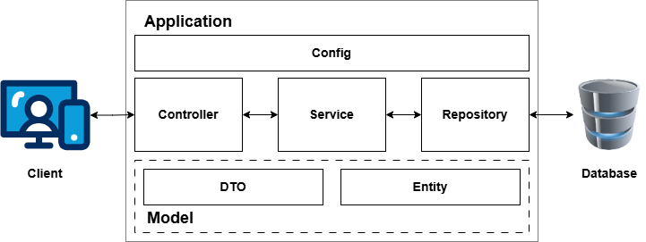
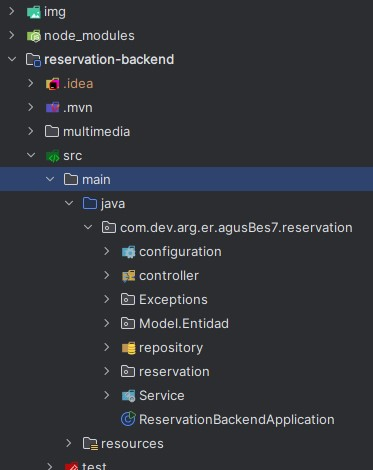
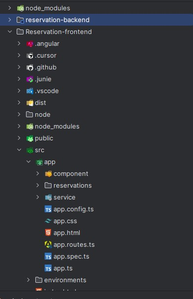
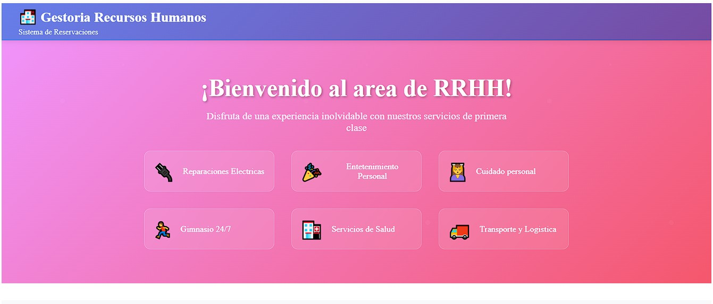
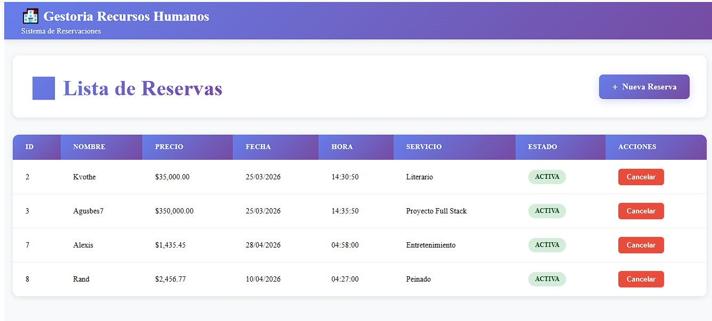
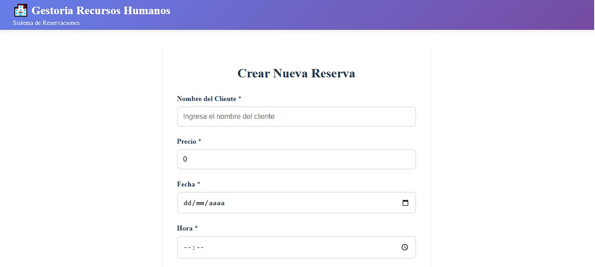

# Bienvenidos

***  
Desarrollaremos un proyecto Full Stack de Reservas basado en la guia y orientacion del curso dictado por DevSeniorCode 
El repositorio del proyecto se encuentra haciendo click [AQUI](https://github.com/cesardiaz-utp/DevSeniorCode-CursoFullStackReservas)

### Herramientas a utilizar

💾  [JDK version +25](https://www.oracle.com/latam/java/technologies/downloads/)  
⭐ [NodeJs version +24](https://nodejs.org/es)  
💾  [Git ](https://git-scm.com/)  

configurar una cuenta en Github y aplicar configuraciones de autoria en tu entorno.
>> git config --global user.name "Tu Nombre"  
>>git config --global user.email "tu@email.com"  

⭐ [PostgreSQL](https://www.postgresql.org/download/) 

>opcional   
 descargar cursor como entorno de desarrollo del proyecto.

realizamos la creacion del proyecto base a traves de [Spring Boot initializer](https://start.spring.io/)

incorporar las siguientes dependencias:
1. Spring WEB
2. Spring Data JPA
3. spring Doc
4. PostgreSQL Driver
5. Lombok
6. bean validation
7. devtools
8. Flyway

Necesitamos incorporar para trabajar objetos JSON la libreria [Gson de google](https://github.com/google/gson) o [jackson](https://mvnrepository.com/artifact/tools.jackson.core/jackson-core) disponible en maven

***  
## Crearemos una aplicacion utilizando un modelo de capas Dividido en varias etapas

>> 

 Comenzaremos trabajando con el backend. Debemos desarrollar las entidades,servicios y controladores requeridos con las reglas de negocio propuestas en el curso.

creamos la entidad y los getters y setters con Lombok.
Utilizando Spring Data JPA con Hibernate  mapeamos la entidad para preparar la llegada de los datos a la BDD

---

## Cambios Realizados - Sprint Final

### Backend
- ✅ Soporte para base de datos H2 en desarrollo (pom.xml actualizado)
- ✅ Mejoras en validaciones del controlador ReservacionController
- ✅ Configuración de application.properties para H2 (create-drop en dev)

#### Estructura de proyecto

### Frontend (Angular 17)
Usamos la IA para generar un header,footer y banner fictios con fines practicos del proyecto

#### Estructura de proyecto

- ✅ Diseño responsivo completo (mobile-first)
- ✅ Header limpio 
- ✅ Banner atractivo con gradiente rosa-rojo y servicios de la empresa
- ✅ Footer con información de contacto y servicios
- ✅ Tabla de reservas mejorada con estilos modernos
- ✅ Media queries optimizadas para 1440px, 1024px, 768px, 640px y 480px
- ✅ Componentes modulares organizados en subcarpetas
- ✅ Colores: Gradiente azul-púrpura (#667eea → #764ba2)

#### Vistas del sitio

  

  

   Final del Readme  

